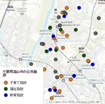

# data-visualization-js

ArcGIS API for JavaScript を用いてデータ ビジュアライゼーションの手法とそれを実現する機能について紹介していく「JavaScript で始めるデータ ビジュアライゼーション」シリーズにおいて使用しているサンプル コード集です。

## サンプル

### 準備編

||||
|:-:|:-:|:-:|
|[マップの表示](basic_simple_map)|[データの表示](basic_add_data)|[シンプル レンダラ](basic_use_renderer)|

### 個別値分類編

||||
|:-:|:-:|:-:|
|[個別値分類](unique_simple)|[個別値分類（凡例付き）](unique_simple_with_legend)|[クライアント側でカテゴリを設定](unique_conversion)|

### 拡張オプション編

||||
|:-:|:-:|:-:|
|[属性情報の表示](enhance_infotemplate)|[関数を用いた属性情報の表示](enhance_infotemplate_function)|[凡例の表示](enhance_legend)|
||||
|[クリック イベント](enhance_click)|||

### 色表現編

||||
|:-:|:-:|:-:|
|[色表現](enhance_infotemplate)|[カラーランプのフォーカス](enhance_infotemplate_function)|[カラーランプの基点を作成](enhance_legend)|
||||
|[数値分類](enhance_click)|||

## 使用している製品・プロジェクト

* [ArcGIS API for JavaScript](https://developers.arcgis.com/javascript/)
* [ESRIジャパン オープンデータポータル](http://data.esrij.com/)
* [ArcGIS for Developers](https://developers.arcgis.com/en/)

**ArcGIS の開発キットを使用して開発を行う場合は ArcGIS Online 開発者アカウント（[ArcGIS for Developers](https://developers.arcgis.com/en/)）が必要です。開発者アカウント作成ガイドは[こちら](http://www.esrij.com/cgi-bin/wp/wp-content/uploads/documents/signup-esri-developers.pdf)**

## 動作環境

* Chrome
* Firefox
* Safari 3+
* Internet Explorer 7+

## リソース

* [ArcGIS 開発者コミュニティ サイト](https://geonet.esri.com/groups/dev-jp)
* [ArcGIS API for JavaScript（ESRIジャパン）](http://www.esrij.com/products/arcgis-api-for-javascript/)
* [リファレンス](https://developers.arcgis.com/javascript/jsapi/)
* [ArcGIS ブログ](http://blog.esrij.com/arcgisblog/2014/12/javascript-9ab3.html)

## ライセンス
Copyright 2015 Esri Japan Corporation.

Apache License Version 2.0（「本ライセンス」）に基づいてライセンスされます。あなたがこのファイルを使用するためには、本ライセンスに従わなければなりません。本ライセンスのコピーは下記の場所から入手できます。

> http://www.apache.org/licenses/LICENSE-2.0

適用される法律または書面での同意によって命じられない限り、本ライセンスに基づいて頒布されるソフトウェアは、明示黙示を問わず、いかなる保証も条件もなしに「現状のまま」頒布されます。本ライセンスでの権利と制限を規定した文言については、本ライセンスを参照してください。

ライセンスのコピーは本リポジトリの[ライセンス ファイル](./LICENSE)で利用可能です。

