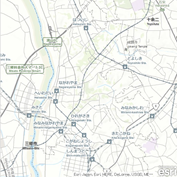
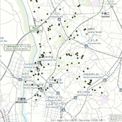
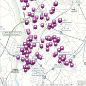
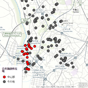
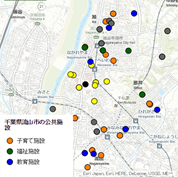
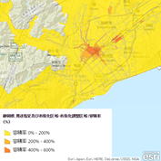

# data-visualization-js

A collection of samples showing how to use the ArcGIS API for JavaScript to create various visualizations.

To explore these samples, you can:
* Click any thumbnail below to see a live sample
* Click the title under a thumbnail to view code

## サンプル

### 準備編

||||
|:-:|:-:|:-:|
|[マップの表示](basic_simple_map)|[データの表示](basic_add_data)|[シンプル レンダラ](basic_use_renderer)|

### 個別値分類編

||||
|:-:|:-:|:-:|
|[個別値分類](unique_simple)|[個別値分類（凡例付き）](unique_simple_with_legend)|[クライアント側でカテゴリを設定](unique_conversion)|

### 拡張オプション編

||||
|:-:|:-:|:-:|
|[属性情報の表示](enhance_infotemplate)|[関数を用いた属性情報の表示](enhance_infotemplate_function)|[凡例の表示](enhance_legend)|
||||
|[クリック イベント](enhance_click)|||

### 色表現編

||||
|:-:|:-:|:-:|
|[色表現](enhance_infotemplate)|[カラーランプのフォーカス](enhance_infotemplate_function)|[カラーランプの基点を作成](enhance_legend)|
||||
|[数値分類](enhance_click)|||

## Resources

* [ArcGIS API for JavaScript](https://developers.arcgis.com/javascript/)
* [ArcGIS Blog](http://blogs.esri.com/esri/arcgis/)
* [twitter@esri](http://twitter.com/esri)

## Issues

Find a bug or want to request a new feature?  Please let us know by submitting an issue.

## Contributing

Esri welcomes contributions from anyone and everyone. Please see our [guidelines for contributing](https://github.com/esri/contributing).

## Licensing
Copyright 2014 Esri

Licensed under the Apache License, Version 2.0 (the "License");
you may not use this file except in compliance with the License.
You may obtain a copy of the License at

   http://www.apache.org/licenses/LICENSE-2.0

Unless required by applicable law or agreed to in writing, software
distributed under the License is distributed on an "AS IS" BASIS,
WITHOUT WARRANTIES OR CONDITIONS OF ANY KIND, either express or implied.
See the License for the specific language governing permissions and
limitations under the License.

A copy of the license is available in the repository's [license.txt](license.txt) file.

​
